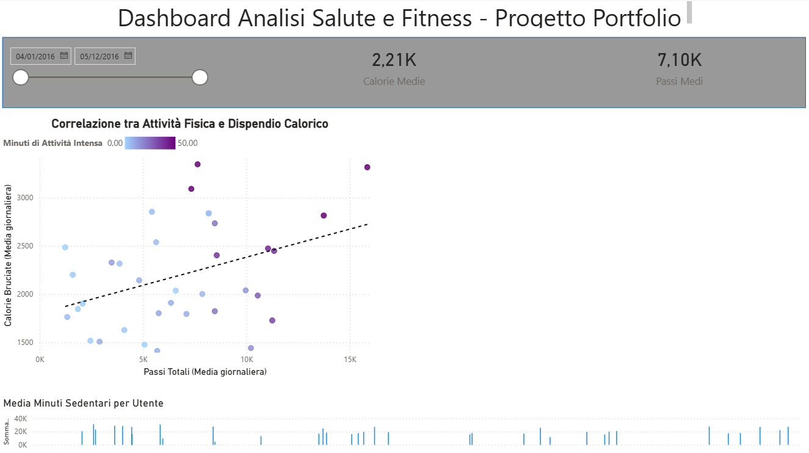

# 📊 Analisi Dati FitBit con Power BI

## 🎯 Obiettivo del Progetto
Analisi del comportamento degli utenti basata sui dataset FitBit per identificare opportunità di crescita e ottimizzazione delle strategie di marketing nel settore wearable.

## 🖼️ Dashboard Interattiva

## 📈 Key Insights
* **Correlazione Attività/Calorie**: Forte legame tra intensità dell'esercizio e dispendio calorico.
* **Analisi Sedentarietà**: Identificati pattern di inattività che suggeriscono l'implementazione di reminder personalizzati.

## 🛠️ Tech Stack
* **Power BI Desktop** (Data Viz & DAX)
* **Dataset**: FitBit Fitness Tracker Data (Kaggle)
